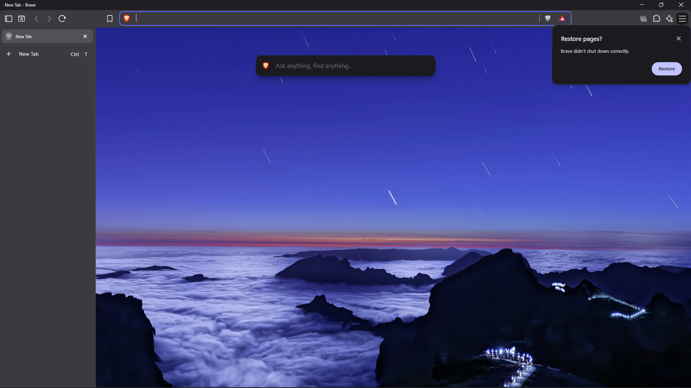

todo:

* make the commads work ╰(*°▽°*)╯ (done) 

* makeit so can it communicate to brave ╰(*°▽°*)╯ (done)

  
<b>* while launches in CDP mode it fails to automatically restore the previous session. Every time the browser is closed and reopened, a prompt annoying pops up in the corner asking: 'Would you like to restore your session?', requiring a manual click each time. </b>

   
  

    
  

* Somehow find the way to identify the tabs What are opened already in brave

* Find a way to replace Elements and queries Inside of the tages